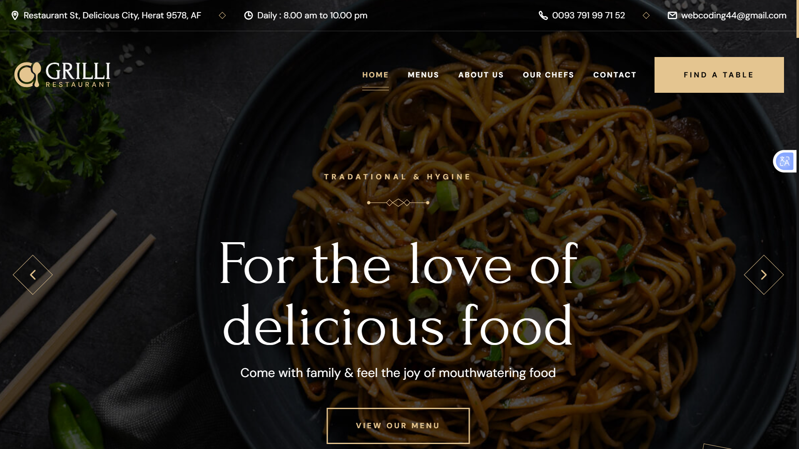

# 🍽️ Animated Restaurant Website

<div align="center">




### ✨ A Beautiful & Fully Animated Restaurant Website

</div>

---

# 📖 Overview

This project is a modern and visually stunning **Restaurant Website** built using pure:

- HTML  
- CSS  
- JavaScript  

The website focuses heavily on:

✨ Smooth animations  
✨ Beautiful UI/UX  
✨ Interactive sections  
✨ Responsive design  
✨ Modern visual effects  

Every section of the website is carefully designed to create an engaging and premium experience for users.

---

# 🔥 Why This Project Is Special

This is not just another restaurant landing page.

This project was built with attention to:

- Animation details  
- User experience  
- Smooth transitions  
- Interactive effects  
- Modern design principles  

The animations and visual experience make the website feel alive and premium.

Honestly, describing it with words is still less impressive than seeing it in action 🚀

---

# ✨ Features

## 🎨 Stunning UI Design

- Modern restaurant layout  
- Elegant typography  
- Attractive color palette  
- Premium visual appearance  

---

## ⚡ Smooth Animations

- Scroll animations  
- Hover effects  
- Transition effects  
- Interactive elements  
- Animated sections  

---

## 📱 Fully Responsive

The website works perfectly on:

- Desktop  
- Tablet  
- Mobile devices  

---

## 🍔 Restaurant Sections

- Hero section  
- About section  
- Food menu  
- Featured dishes  
- Chef section  
- Customer reviews  
- Contact section  
- Footer  

---

# 🛠️ Technologies Used

## 🧱 HTML5

Used for building the website structure and semantic layout.

---

## 🎨 CSS3

Used for:

- Styling  
- Layout design  
- Animations  
- Responsive design  
- Visual effects  

---

## ⚙️ JavaScript

Used for:

- Interactive functionality  
- Dynamic animations  
- Scroll effects  
- User interactions  


# 🚀 Getting Started

## 1️⃣ Clone the repository

```bash
git clone https://github.com/yourusername/restaurant-website.git
```

---

## 2️⃣ Open the project

Simply open:

```bash
index.html
```

in your browser.

---

# 🎨 Design Goals

The main goal of this project was to create a website that feels:

- Modern  
- Elegant  
- Smooth  
- Interactive  
- Professional  

Every animation and section was designed carefully to improve user engagement.

---

# 💡 What You Can Learn From This Project

- Advanced CSS animations  
- Responsive web design  
- JavaScript DOM interactions  
- Modern landing page structure  
- UI/UX principles  
- Scroll-based animations  

---

# 🚀 Future Improvements

- Online reservation system  
- Dark mode support  
- Food ordering feature  
- Backend integration  
- Dynamic menu management  
- Authentication system  

---

# ⭐ Project Highlights

✅ Beautiful animations  
✅ Responsive design  
✅ Clean UI  
✅ Interactive experience  
✅ Modern web techniques  
✅ Pure HTML, CSS & JavaScript  

---

# ❤️ Final Note

This project is a combination of creativity, animation, and modern frontend development.

It was built to create an unforgettable visual experience for users while showcasing a stylish restaurant brand online.

---

<div align="center">

## 🍽️ Crafted with HTML, CSS & JavaScript

Made with ❤️ and lots of animations ✨

</div>